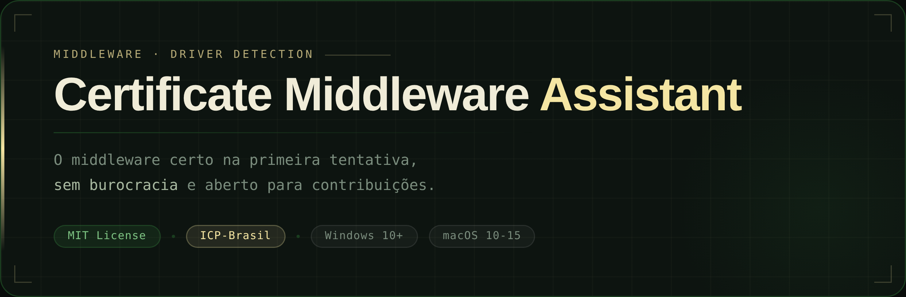
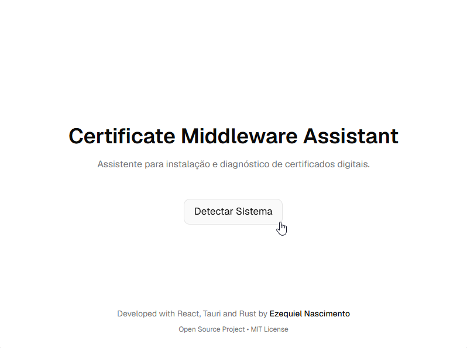
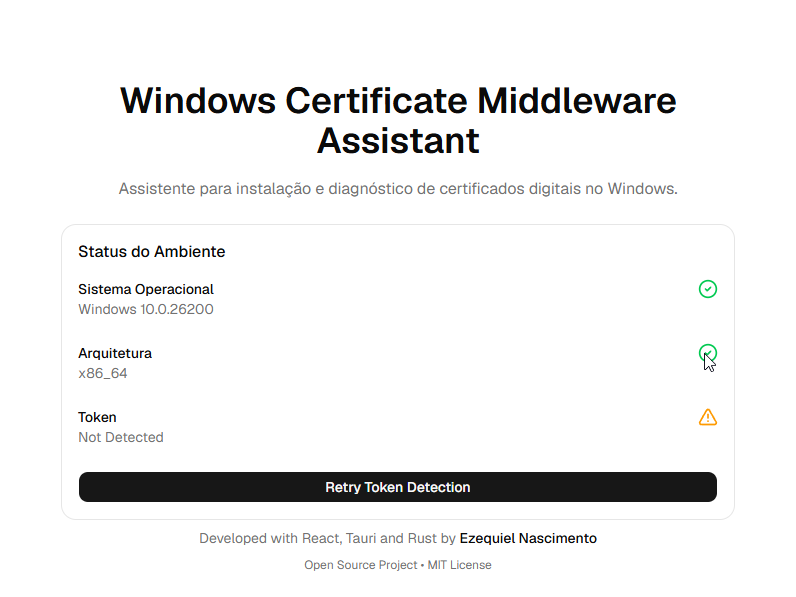
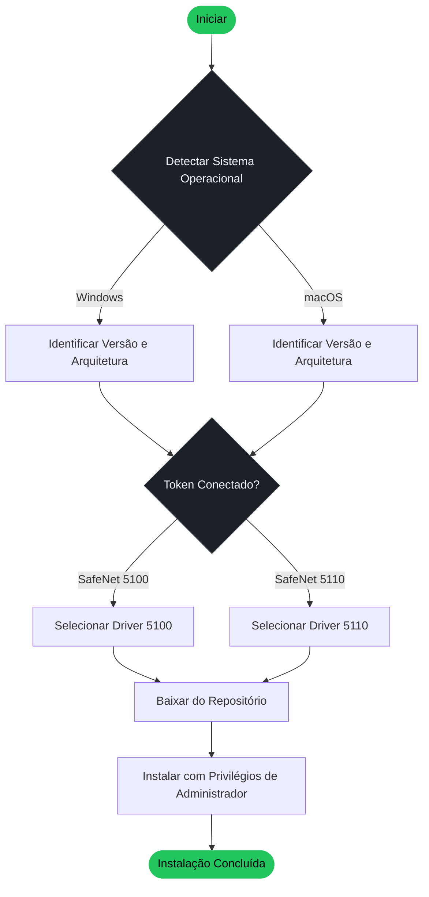

<div align="center">
  
  <br/>
  <br/>


</div>

<br>

> _"O melhor software nasce de um problema real, sentido por uma pessoa real."_

## Por que este projeto existe?

Tudo começou com uma situação simples: uma advogada precisava utilizar seu certificado digital em um MacBook.

O que deveria ser uma configuração simples acabou se transformando em horas de pesquisa, consultas a documentações técnicas, tentativas de contato com diferentes canais de suporte e inúmeras verificações de compatibilidade entre versões do macOS, arquitetura e drivers disponíveis. Em determinado momento, a única solução apresentada foi a aquisição de uma ferramenta de terceiros.

Mas, ao investigar o problema mais a fundo, ficou claro que a solução já existia. Era apenas uma questão de identificar e instalar a versão correta do middleware compatível com aquele ambiente.

A instalação funcionou. O problema nunca foi a falta de uma solução, era a dificuldade de encontrá-la.

O **Certificate Middleware Assistant** nasceu dessa experiência. A ferramenta automatiza a identificação do ambiente e auxilia na instalação da versão compatível do middleware, transformando um processo manual, técnico e demorado em algo muito mais simples.

---

## Sobre o Projeto

**Certificate Middleware Assistant** é uma aplicação desktop multiplataforma desenvolvida para o ecossistema de **certificado digital brasileiro (ICP-Brasil)**. Ela elimina o processo manual de identificar, baixar e instalar o driver correto do middleware SafeNet para tokens de segurança, detectando automaticamente o ambiente e executando a instalação com uma única ação.

Construída com [Tauri v2](https://tauri.app/), entrega uma **experiência nativa e leve** no Windows e macOS, sem o peso de memória e processamento característico de soluções baseadas em Electron.

---

## Capturas de Tela

<div align="center">
  <tr>
    <td align="center">
      <i>Screenshot da tela principal</i>
      <br/>
        
      <br/><br/>
        <i>Screenshot da tela principal</i>
        <br/><br/>
        
    </td>
  </tr>
</div>
<!-- <div>
  <div>
    <div align="center" width="50%">
          <i>Screenshot da tela principal</i>
      <br/>
        
      <br/><br/>
        <i>Screenshot da tela principal</i>
      <br/>
        
      <br/><br/>
    </div>
  </div>
</div> -->

<br>

## Como Funciona

<div align="center">



</div>

## Funcionalidades

| Recurso                      | Descrição                                                                                                                        |
| ---------------------------- | -------------------------------------------------------------------------------------------------------------------------------- |
| Detecção de Ambiente         | Identifica automaticamente o sistema operacional, versão e arquitetura do dispositivo (32 bits, 64 bits, Intel ou Apple Silicon) |
| Reconhecimento de Token      | Detecta o modelo do token de segurança conectado ao dispositivo                                                                  |
| Instalação Inteligente       | Obtém e instala o driver correto diretamente do repositório, sem intervenção manual                                              |
| Gerenciamento de Privilégios | Solicita permissões de administrador apenas quando necessário para a instalação                                                  |
| Arquitetura Extensível       | Projetada para incorporar novos modelos de token com mínimo esforço de desenvolvimento                                           |

---

## Tokens Suportados

| Token                         | Fabricante       | Status                                                               |
| ----------------------------- | ---------------- | -------------------------------------------------------------------- |
| SafeNet 5100                  | Thales Group     |  |
| SafeNet 5110                  | Thales Group     |  |
| GD Starsign (GD Burti)        | G+D              |  |
| StarSign Crypto (USB-Token S) | G+D              |  |
| eToken Pro (Aladdin)          | SafeNet / Thales |  |

> Quer ver o seu token suportado? [Abra uma issue](https://github.com/Ki3lMigu3l/macos-certificate-middleware-assistant/issues) ou envie um pull request.

---

## Requisitos do Sistema

> Privilégios de administrador são necessários para instalação dos drivers em todas as plataformas.

### Windows

| Requisito           | Valor                         |
| ------------------- | ----------------------------- |
| Sistema Operacional | Windows 10 ou superior        |
| Arquitetura         | x86 (32 bits) e x64 (64 bits) |
| Privilégios         | Administrador                 |

---

### macOS

| Pacote de Driver                 | Versões Suportadas                | Arquitetura           |
| -------------------------------- | --------------------------------- | --------------------- |
| SafeNet Authentication Client    | macOS 11 a 15 (Big Sur → Sequoia) | Apple Silicon + Intel |
| Pacote de Compatibilidade Sonoma | macOS 14.0                        | Apple Silicon + Intel |
| SafeNet Authentication Client    | macOS 11 (Big Sur)                | Intel apenas          |
| SafeNet Authentication Client    | macOS 10 (Catalina)               | Intel apenas          |

> O Pacote de Compatibilidade com o macOS 14.0 Sonoma (CCID) não é necessário após atualização para macOS 14.1 ou superior, conforme orientação oficial da Thales Group.

---

## Stack Tecnológica

| Camada            | Tecnologia                                                                         |
| ----------------- | ---------------------------------------------------------------------------------- |
| Framework Desktop | [Tauri v2](https://tauri.app/)                                                     |
| Frontend          | [React 19](https://react.dev/) + [TypeScript 5.8](https://www.typescriptlang.org/) |
| Estilização       | [Tailwind CSS v4](https://tailwindcss.com/)                                        |
| Componentes UI    | [shadcn/ui](https://ui.shadcn.com/) + [Base UI](https://base-ui.com/)              |
| Animações         | [Framer Motion](https://www.framer.com/motion/)                                    |
| Ícones            | [Lucide React](https://lucide.dev/)                                                |
| Build             | [Vite 7](https://vitejs.dev/)                                                      |

---

## Como Começar

### Pré-requisitos

- [Node.js](https://nodejs.org/) v18 ou superior
- [Rust](https://www.rust-lang.org/tools/install) - obrigatório pelo Tauri
- [Tauri v2](https://tauri.app/start/prerequisites/)

### Instalação

```bash
# Clone o repositório
git clone https://github.com/Ki3lMigu3l/macos-certificate-middleware-assistant.git
cd macos-certificate-middleware-assistant/apps/desktop

# Instale as dependências
pnpm install
```

### Ambiente de Desenvolvimento

```bash
pnpm tauri dev
```

### Build de Produção

```bash
pnpm tauri build
```

O binário compilado estará disponível em `src-tauri/target/release/`.

---

## Testes

Os testes unitários cobrem a lógica central de detecção de ambiente e instalação de drivers.

| Plataforma | Status                                                                               |
| ---------- | ------------------------------------------------------------------------------------ |
| Windows    |  |
| macOS      |  |

---

## Roadmap

- [x] Suporte ao SafeNet 5100
- [x] Suporte ao SafeNet 5110
- [x] Validação e testes no macOS
- [ ] Suporte ao GD Starsign (GD Burti)
- [ ] Suporte ao StarSign Crypto (USB-Token S)
- [ ] Suporte ao eToken Pro (Aladdin)
- [ ] Pipeline de release automatizado (`.dmg` / `.exe`)
- [ ] Mecanismo de atualização automática

---

## Contribuindo

Contribuições são bem-vindas. O projeto segue as práticas padrão de open-source.

**1**. _Faça um fork do repositório_;
**2**. _Crie uma branch para sua feature_;

```bash
git checkout -b feature/novo-token
```

**3**. _Faça commit das alterações seguindo [Conventional Commits](https://www.conventionalcommits.org/pt-br/)_;

```bash
git commit -m "feat: adiciona suporte ao eToken Pro Aladdin"
```

**4**. _Envie para sua branch_;

```bash
git push origin feature/novo-token
```

**5**. _Abra um Pull Request descrevendo as mudanças e a motivação_.

Novas funcionalidades devem estar cobertas por testes unitários antes do envio.

---

## Licença

Distribuído sob a **Licença MIT**. Consulte o arquivo [LICENSE](LICENSE) para detalhes.
